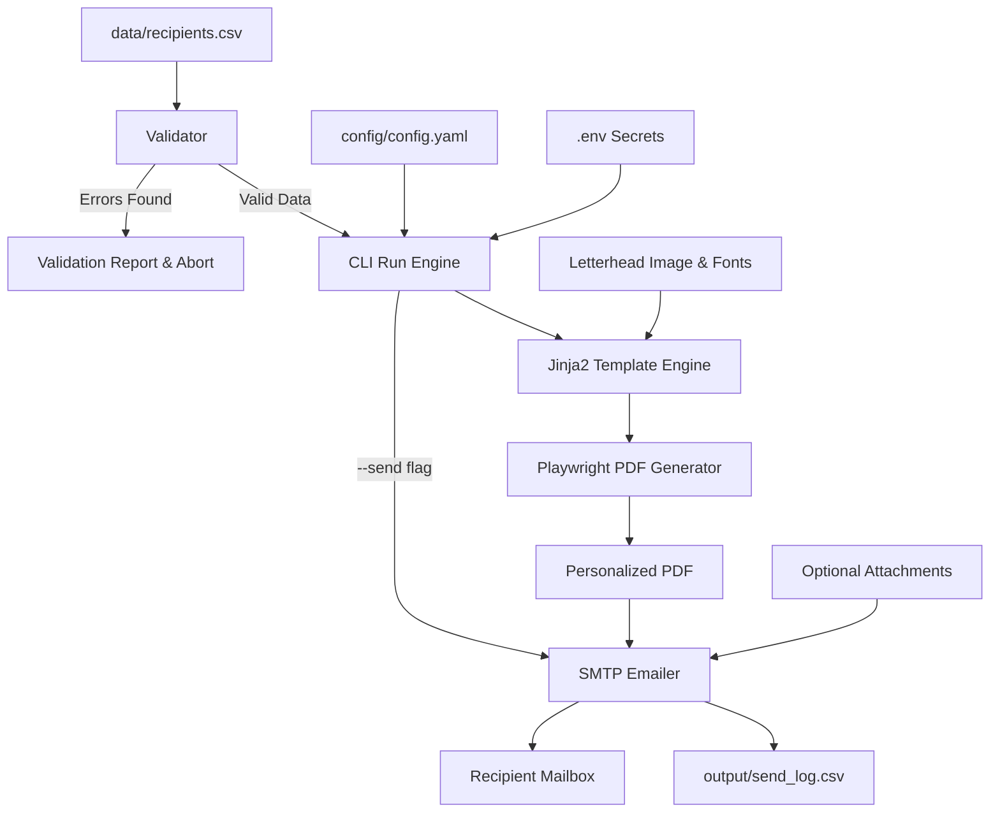

# 📜 Appointment & Offer Letter Automation System

A robust, CLI-driven automation suite designed to generate personalized, pixel-perfect appointment letters, offer letters, or certificates on official letterheads and deliver them to recipients via email with audit logging and rate-limiting.

Powered by **Python**, **Jinja2**, **Playwright (Chromium)**, and **SMTP**.

---

## 🌟 Highlights & Features

- **Pixel-Perfect PDF Generation**: Renders dynamic recipient text precisely onto pre-designed A4 portrait letterhead graphics (PNG/JPG) using headless Chromium.
- **Dynamic Content & Role Adaptation**: Tailors letter content, team responsibilities, and leadership paragraphs dynamically based on role (`Lead`, `Co-Lead`, `Member`) and team assignments.
- **Auto-Fit & Overflow Protection**: Automatically shrinks font sizes if personalized text exceeds content margins, guaranteeing single-page integrity.
- **Strict CSV Ingestion & Validation**: Comprehensive pre-flight checks validating schema, email syntax, canonical roles, and valid team identifiers with clear error reports.
- **Idempotency & Send Logging**: Tracks every operation in `output/send_log.csv` (`PENDING`, `GENERATED`, `SENT`, `FAILED`), making runs safely resumable without double-sending emails.
- **Safe Staging & Dry-Runs**:
  - Full dry-run mode: Generate all PDFs and preview email bodies without connecting to SMTP.
  - Safe email routing: Redirect all outgoing emails to a single tester address (`--test-email`).
  - Targeted delivery: Filter runs by recipient email (`--only`) or team (`--team`).
  - Retry mechanism: Process only failed dispatches (`--retry-failed`).
- **Rich Visual CLI**: Clean console output with progress indicators, calibration guides, and run summaries.

---

## 🔄 Workflow Diagram



---

## 📁 Repository Structure

```
.
├── main.py                          # CLI entrypoint
├── src/
│   ├── config.py                    # Configuration loader (config.yaml + .env)
│   ├── emailer.py                   # SMTP client with backoff and retries
│   ├── log.py                       # Persistent send_log.csv manager
│   ├── pdf_gen.py                   # Playwright PDF rendering & font scaler
│   └── validate.py                  # Recipient CSV validation & normalization
├── templates/
│   ├── letter.html                  # Jinja2 appointment letter HTML template
│   ├── email.html                   # HTML email body template
│   └── email.txt                    # Plaintext fallback email template
├── config/
│   └── config.yaml.example          # Sample configuration template
├── data/
│   └── recipients.sample.csv        # Sample recipient dataset
├── assets/
│   ├── letterhead.png               # Sample A4 letterhead background
│   └── fonts/                       # Custom TTF font directory (.gitkeep)
├── scripts/
│   └── create_sample_letterhead.py  # Utility script to generate a sample letterhead
├── tests/
│   ├── test_letter_content.py       # Unit tests for template rendering
│   ├── test_log.py                  # Unit tests for send logging
│   └── test_validate.py             # Unit tests for CSV validation
├── .env.example                     # Environment secrets template
├── .gitignore                       # Strict ignore rules for private data
├── requirements.txt                 # Python package dependencies
└── README.md                        # Documentation
```

---

## 🚀 Quick Start Guide

### 1. Prerequisites & Environment Setup

Clone the repository and set up a Python virtual environment:

```bash
# Clone the repository
git clone https://github.com/YOUR_USERNAME/aws_letter_automate.git
cd aws_letter_automate

# Create and activate virtual environment
python3 -m venv venv
source venv/bin/activate       # macOS / Linux
# .\venv\Scripts\activate      # Windows

# Install dependencies
pip install -r requirements.txt

# Install Playwright browser engine (one-time setup)
playwright install chromium
```

### 2. Configure Secrets (`.env`)

Copy the example environment file and configure your SMTP credentials:

```bash
cp .env.example .env
```

Edit `.env`:
```ini
SMTP_HOST=smtp.gmail.com
SMTP_PORT=587
SMTP_USER=your_organization@gmail.com
SMTP_APP_PASSWORD=xxxx xxxx xxxx xxxx
FROM_NAME=Your Organization / Club Name
```

> **Note on Gmail SMTP**: Normal passwords will not work. Generate a 16-character **Google App Password** at [myaccount.google.com/apppasswords](https://myaccount.google.com/apppasswords) (requires 2-Step Verification to be enabled).

### 3. Configure Project Settings (`config.yaml`)

Copy the example configuration:

```bash
cp config/config.yaml.example config/config.yaml
```

Update `config/config.yaml` with your organization name, college/institute, team definitions, and content bounds.

### 4. Setup Letterhead Background

Place your pre-designed A4 portrait letterhead image (PNG or JPG at 300 DPI, 2480 × 3508 px) at `assets/letterhead.png` (or update `letterhead.image` in `config.yaml`).

Need a placeholder to get started immediately? Run the generator:

```bash
python scripts/create_sample_letterhead.py
```

### 5. Preview & Calibrate Margins

Verify how the layout looks and adjust millimeter margins:

```bash
# Generates 3 sample letters (Lead, Member, Long Name)
python main.py preview

# Shows a red bounding box indicating the printable text area
python main.py preview --guides
```

Preview files are saved to `output/preview/`.

### 6. Populate Recipients & Validate

Add your recipients list:

```bash
cp data/recipients.sample.csv data/recipients.csv
```

CSV format:

| Column | Required | Notes |
|---|---|---|
| `name` | Yes | Automatically normalized to Title Case |
| `email` | Yes | Validated for syntax and duplicate entries |
| `team` | Yes | Must correspond to a defined key under `teams:` in `config.yaml` |
| `role` | Yes | Allowed values: `Lead`, `Co-Lead`, `Member` (case-insensitive) |
| `roll_no` | Optional | Student identifier / Roll number |
| `year` | Optional | E.g. `1st Year`, `SE`, `TE` |
| `department` | Optional | E.g. `Computer Science`, `IT`, `ECE` |

Validate the dataset before running:

```bash
python main.py validate
```

### 7. Run Generation & Dispatch

Always execute a dry run first:

```bash
# Dry run: Generates PDFs in output/letters/, tests template rendering, no emails sent
python main.py run
```

Send a test email to your own inbox:

```bash
python main.py run --send --test-email your_email@gmail.com
```

Execute live send to all verified recipients:

```bash
python main.py run --send
```

---

## 🛠️ Command-Line Interface (CLI) Reference

| Command | Description |
|---|---|
| `python main.py preview` | Generates 3 calibration sample PDFs in `output/preview/`. |
| `python main.py preview --guides` | Draws red alignment boundaries around the content box for visual calibration. |
| `python main.py validate` | Verifies `data/recipients.csv` against rules and reports any errors without running. |
| `python main.py run` | **Dry Run**: Generates PDFs in `output/letters/` and logs operations without sending emails. |
| `python main.py run --send` | **Live Run**: Generates PDFs and sends emails to recipients. |
| `python main.py run --send --test-email <email>` | Live run routing all emails to a single test address. |
| `python main.py run --send --only <email>` | Processes exclusively the specified recipient. |
| `python main.py run --send --team "<team>"` | Processes only recipients assigned to the given team. |
| `python main.py run --send --retry-failed` | Retries only entries marked `FAILED` in `output/send_log.csv`. |
| `python main.py run --send --force` | Re-sends emails even if recipient is already marked `SENT`. |
| `python main.py run --throttle <sec>` | Adjusts delay between consecutive email dispatches (default: `2.0`s). |
| `python main.py run --reset-log` | Resets `output/send_log.csv` before running. |

---

## ⚙️ Configuration Reference (`config.yaml`)

```yaml
club_name: "Developer Community"
college_name: "Institute of Technology"
academic_year: "2026-27"
issue_date: "auto"                   # "auto" (today's date) or explicit e.g. "30 September 2026"

issuer_name: "Alex Johnson"
issuer_designation: "Community Lead"
captain_name: "Alex Johnson"
faculty_coordinator: "Prof. Morgan"

tenure: "1 year"
reference_prefix: "DEVCOM-2026"
print_closing: true
team_list_pdf: ""                   # Optional additional attachment path (e.g. "team_list.pdf")

closing_line: "Warm regards,"

# Injected paragraph for Lead and Co-Lead roles
lead_addition: "As {{ role_title }}, you will also guide your team members, coordinate their tasks and report progress to the core committee."

letterhead:
  image: "assets/letterhead.png"
  content_top_mm: 53                 # Distance from top edge to letter start
  content_bottom_mm: 52              # Distance from bottom edge to signature/footer
  content_left_mm: 14                # Left margin
  content_right_mm: 16               # Right margin
  font_family: "Liberation Serif"
  font_file_regular: ""              # Optional custom .ttf path in assets/fonts/
  font_file_bold: ""                 # Optional custom bold .ttf path
  font_size_pt: 12.2                 # Base typography size
  min_font_size_pt: 10               # Minimum auto-shrink size
  text_color: "#1a1a1a"

email_subject: "Congratulations {{ first_name }}! You're selected for the {{ team }} Team"
onboarding_link: "https://chat.whatsapp.com/sample_invite_link"
onboarding_datetime: "TBD"
merch_form_link: "https://forms.gle/sample_form_link"

teams:
  Technical:
    code: "TECH"
    responsibility: "As part of the Technical Team, your primary responsibility will be to lead hands-on workshops, develop open-source projects, and mentor community members."
  Design:
    code: "DES"
    responsibility: "As part of the Design Team, you will craft visual assets, brand identity guidelines, and presentation collateral for community events."
```

---

## 🧪 Testing

The test suite covers template rendering, role phrase assertions, CSV normalization, config validation, and log file idempotency.

Run all tests with:

```bash
pytest tests/ -v
```

---

## 🔒 Security & Data Privacy

- **Never Commit Secrets**: `.env` and `*.env` are strictly excluded in `.gitignore`.
- **Private Data Protection**: Active recipient lists (`data/recipients.csv`), audit logs (`output/send_log.csv`), and generated PDFs are excluded from version control.
- **Letterhead Protection**: Private letterhead images containing real signatures are ignored by default. Sample template generators are provided.
- **App Password Security**: Use application-specific passwords rather than primary email credentials and revoke them when operations conclude.

---

## 📄 License

This project is licensed under the [MIT License](LICENSE).
